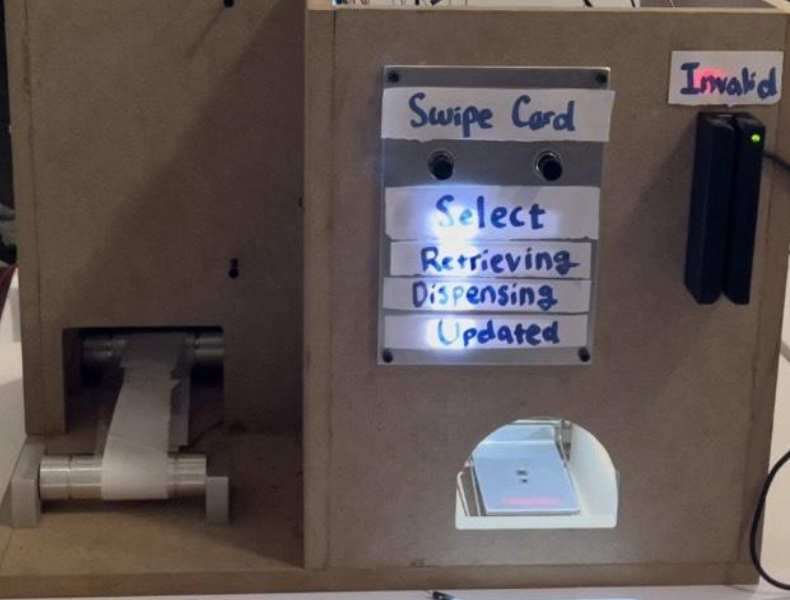

# 445

An autonomous food container dispenser machine. 

Team Members:

Ariocie Liang (arliang2), John Kim (jaehank2), Henry Guan (henryg3)

## PROBLEM

Good2Go (G2G) containers are used all throughout dining halls for individuals wanting to take their food to go. The program allows you to trade in an old container for a token, where that token can then be used to trade for a new container. This is a hassle for both parties that handle the entire process. It's very redundant and can be streamlined/improved with mechanical assistance.

## SOLUTION

Our solution involves a token/food container swapping machine that serves 2 main functions:

Have a G2G token, that upon deposit, returns a clean container.
Accept a used container, returning a G2G token or a clean container.
The goal here is to make the process semi-autonomous by removing 2 stages of interaction, as well as speeding up the entire process by doing so.
