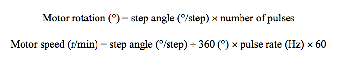

<h1 align="center"> John Kim (jaehank2) Worklog </h1>

* [Summary](#summary)
* [Week of 2022-01-24](#week-of-2022-01-24)  
* [Week of 2022-02-01](#week-of-2022-02-01)  
* [Week of 2022-02-07](#week-of-2022-02-07)  
* [Week of 2022-02-14](#week-of-2022-02-14)  
* [Week of 2022-02-21](#week-of-2022-02-21)  
* [Week of 2022-02-28](#week-of-2022-02-28)  
* [Week of 2022-03-07](#week-of-2022-03-07)  
* [Week of 2022-03-14](#week-of-2022-03-14)  
* [Week of 2022-03-21](#week-of-2022-03-21)  
* [Week of 2022-03-28](#week-of-2022-03-28)  
* [Week of 2022-04-04](#week-of-2022-04-04)  
* [Week of 2022-04-11](#week-of-2022-04-11)  
* [Week of 2022-04-18](#week-of-2022-04-18)  
* [Week of 2022-04-25](#week-of-2022-04-25)  
* [Week of 2022-05-02](#week-of-2022-05-02)  

## Summary
This is a notebook outlining the work and progress I made from the start of the project.

## Week of 2022-01-24
* **01/25 (Getting Started on the RFA)**:
  * <ins>Objectives</ins>: Get to know the team and familiarize with the problem statement that the team is trying to solve
  * <ins>Overview</ins>: Our team was trying to automate a currently existent service used at the U of I dining halls. However, I was not too familiar with the current system and thus had to search online for how exactly the Good2Go system was managed and what problems there were. I realized that the current system required students to first receive a physical token and find a dining hall employee to exchange it for a new take-out container. After identifying the problems, I started working on the RFA (request for approval) to get started on our project.

## Week of 2022-02-01
* **02/01 (RFA Submission and Starting on Proposal)**:
  * <ins>Objectives</ins>: Get the RFA approved and start working on the proposal
  * <ins>Overview</ins>: The initial RFA post got rejected mainly because our team was not specific about the subsystem requirements. My team and I had a discussion with a TA named Dean Biskup to identify what we were missing in the RFA. I had a general idea of what kind of modules we were going to need for the project such as a motor, ID verification method, UI interface, and power supply components, the specifics were missing out as to how to integrate the entire components. I started looking into the details of each subsystem and was able to design an abstract FSM (finite state machine) with specific modules such as the QR scanner, scale, two sets of motors, display and a card reader. Additionally, I started outlining the criterion of success for our project, which required:
    1. Storing the tokens digitally for each user
    2. Allowing exchange between not only tokens for new containers but also old containers for new containers

## Week of 2022-02-07
* **02/07 (Complete and Submit Proposal)**:
  * <ins>Objectievs</ins>: Complete the proposal for submission
  * <ins>Overview</ins>: Even after getting the RFA approved, the proposal required extra work from each member. I was responsible for the design as well as the tolerance analysis. Our project required a mechanism to dispense exactly one container upon a single request, and the design that I came up with was to have two mechanical arms retracting in a order shown in the image below to dispense a single container while reloading the other containers.  
  &nbsp; &nbsp; 

&nbsp; &nbsp; &nbsp; &nbsp; &nbsp; &nbsp; &nbsp; &nbsp; The design for the retrieval system required the machine to parallelize the sensor validtion process with the control subsystem. This was  
&nbsp; &nbsp; &nbsp; &nbsp; &nbsp; &nbsp; &nbsp; &nbsp; to allow the machine to retrieve a returned container the moment it finished validating the container, and thus I made a design to have  
&nbsp; &nbsp; &nbsp; &nbsp; &nbsp; &nbsp; &nbsp; &nbsp; two mechanical arms attached beneath the scale to lift up upon a command from the microcontroller. The image below shows physical  
&nbsp; &nbsp; &nbsp; &nbsp; &nbsp; &nbsp; &nbsp; &nbsp; design of the retrieval system.

&nbsp; &nbsp; &nbsp; &nbsp; &nbsp; &nbsp; &nbsp; &nbsp; 

&nbsp; &nbsp; &nbsp; &nbsp; &nbsp; &nbsp; &nbsp; &nbsp; The tolerance analysis was done on the motors using the below equation. Since our project requried a safe and accurate control  
&nbsp; &nbsp; &nbsp; &nbsp; &nbsp; &nbsp; &nbsp; &nbsp; mechanism of the motors, it required measurements on the angular position as well as the RPM (rotation per minute) of the two motors  
&nbsp; &nbsp; &nbsp; &nbsp; &nbsp; &nbsp; &nbsp; &nbsp; we were planning on using. The motor used for the retrieval system needed a closed loop feedback system to be able to rotate properly  
&nbsp; &nbsp; &nbsp; &nbsp; &nbsp; &nbsp; &nbsp; &nbsp; and the speed of the motor was controlled by sending different pulse data. 

&nbsp; &nbsp; &nbsp; &nbsp; &nbsp; &nbsp; &nbsp; &nbsp; 

* **02/11 (PCB Discussion)**:
  * <ins>Objectives</ins>: Discuss the components of the PCB and general pin layout
  * <ins>Overview</ins>:

## Week of 2022-02-14
* 02/16 (Design Document):
  * <ins>Objectives</ins>:
  * <ins>Overview</ins>:

## Week of 2022-02-21
* 02/21: design doc check
  * <ins>Objectives</ins>:
  * <ins>Overview</ins>:
* 02/23: changes to dd
  * <ins>Objectives</ins>:
  * <ins>Overview</ins>:
* 02/27: pcb parts
  * <ins>Objectives</ins>:
  * <ins>Overview</ins>:

## Week of 2022-02-28
* 03/04: start on motor code
  * <ins>Objectives</ins>:
  * <ins>Overview</ins>:

## Week of 2022-03-07
* 03/07: finish pseudocode
  * <ins>Objectives</ins>:
  * <ins>Overview</ins>:
* 03/10: machine shop design
  * <ins>Objectives</ins>:
  * <ins>Overview</ins>:

## Week of 2022-03-14
* 03/15: parts finalized
  * <ins>Objectives</ins>:
  * <ins>Overview</ins>:
* 03/17: machine shop order placed
  * <ins>Objectives</ins>:
  * <ins>Overview</ins>:

## Week of 2022-03-21
* 03/21: start on fsm software
  * <ins>Objectives</ins>:
  * <ins>Overview</ins>:
* 03/26: pcb testing & revision
  * <ins>Objectives</ins>:
  * <ins>Overview</ins>:

## Week of 2022-03-28
* 03/28: individual progress report
  * <ins>Objectives</ins>:
  * <ins>Overview</ins>:
* 03/29: servo motor code
  * <ins>Objectives</ins>:
  * <ins>Overview</ins>:
* 04/02: software start button
  * <ins>Objectives</ins>:
  * <ins>Overview</ins>:
* 04/03: hardware for button and finish
  * <ins>Objectives</ins>:
  * <ins>Overview</ins>:

## Week of 2022-04-04
* 04/04: Software non-contin servo complete
  * <ins>Objectives</ins>:
  * <ins>Overview</ins>:
* 04/07: Software load cell
  * <ins>Objectives</ins>:
  * <ins>Overview</ins>:
* 04/08: load cell
  * <ins>Objectives</ins>:
  * <ins>Overview</ins>:
* 04/09: load cell finish and QR start
  * <ins>Objectives</ins>:
  * <ins>Overview</ins>:

## Week of 2022-04-11
* 04/11: finish QR
  * <ins>Objectives</ins>:
  * <ins>Overview</ins>:
* 04/12: card reader code start
  * <ins>Objectives</ins>:
  * <ins>Overview</ins>:
* 04/13: fail and debug
  * <ins>Objectives</ins>:
  * <ins>Overview</ins>:
* 04/14: different method
  * <ins>Objectives</ins>:
  * <ins>Overview</ins>:
* 04/15: msr90
  * <ins>Objectives</ins>:
  * <ins>Overview</ins>:
* 04/16: finish card reader
  * <ins>Objectives</ins>:
  * <ins>Overview</ins>:
* 04/17: integrate
  * <ins>Objectives</ins>:
  * <ins>Overview</ins>:

## Week of 2022-04-18
* 04/19: try lcd but use led
  * <ins>Objectives</ins>:
  * <ins>Overview</ins>:
* 04/22: mock demo
  * <ins>Objectives</ins>:
  * <ins>Overview</ins>:
* 04/23: debugging and led lights
  * <ins>Objectives</ins>:
  * <ins>Overview</ins>:
* 04/24: enclosure
  * <ins>Objectives</ins>:
  * <ins>Overview</ins>:

## Week of 2022-04-25
* 04/26: final demo
  * <ins>Objectives</ins>:
  * <ins>Overview</ins>:
* 04/27: start ppt
  * <ins>Objectives</ins>:
  * <ins>Overview</ins>:

## Week of 2022-05-02
* 05/03: final ppt presentation
  * <ins>Objectives</ins>:
  * <ins>Overview</ins>:
